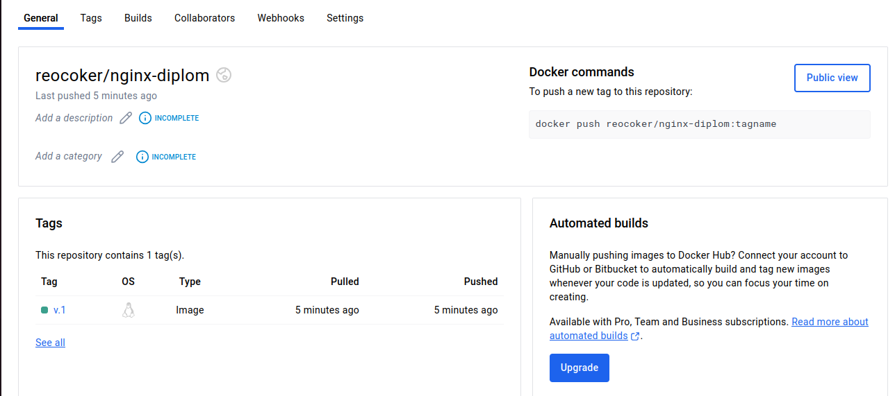
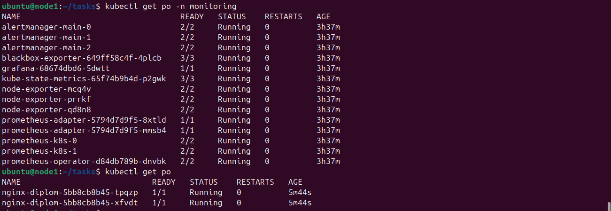
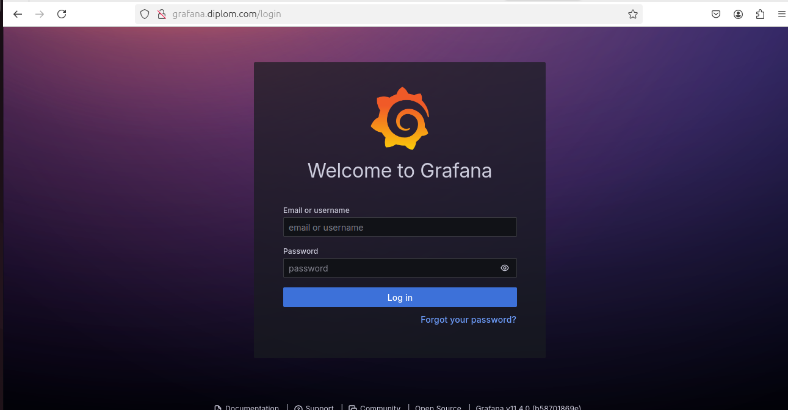
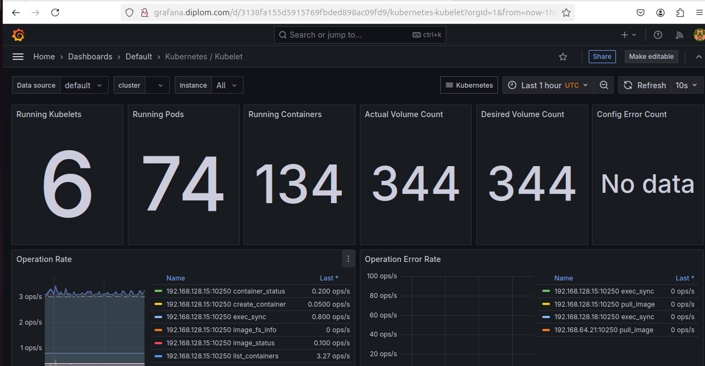
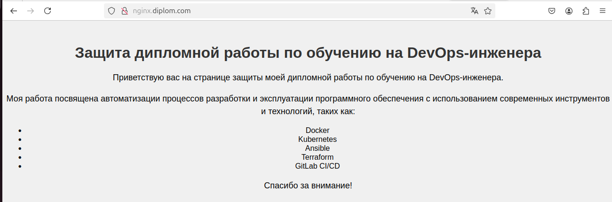
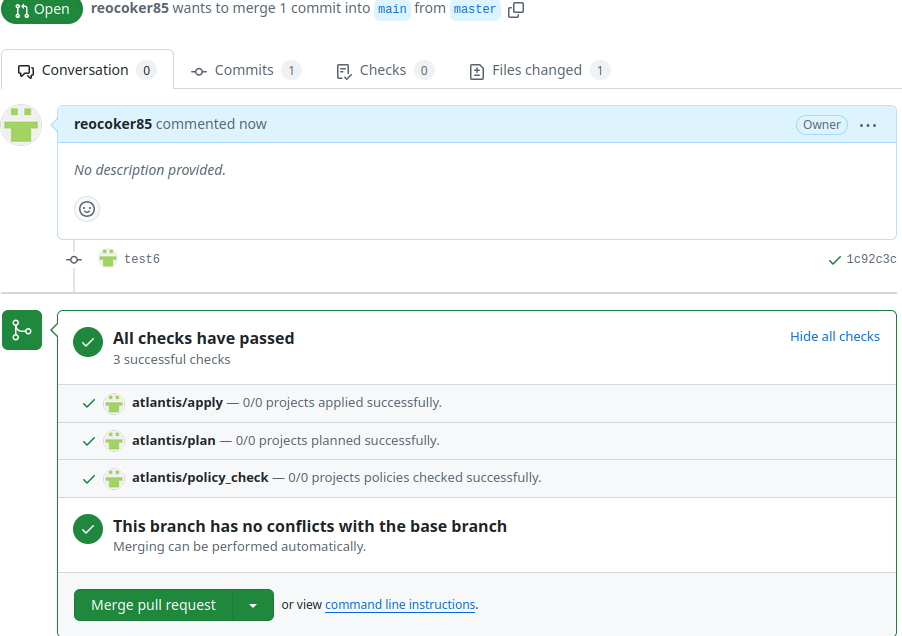
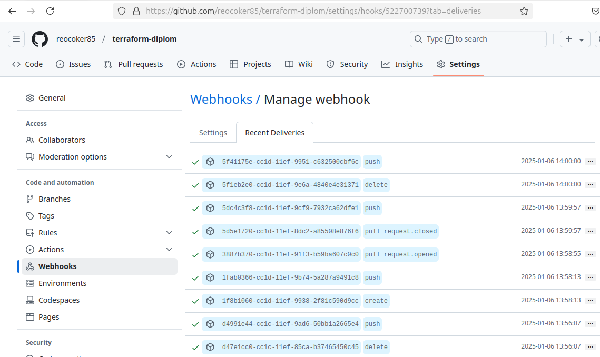
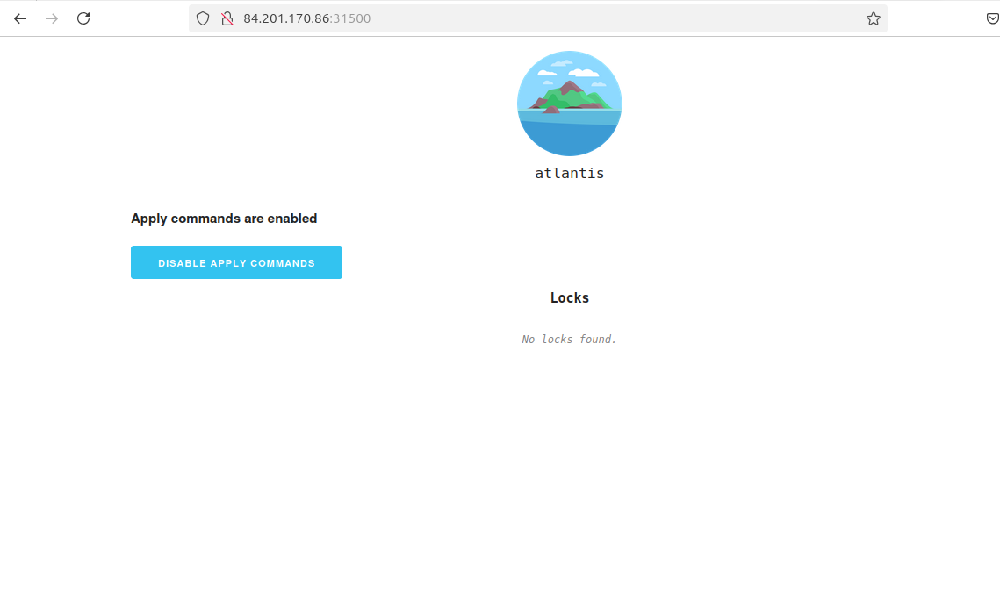
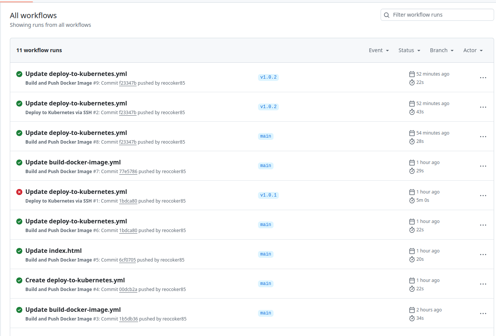

# Дипломный практикум в Yandex.Cloud
  * [Цели:](#цели)
  * [Этапы выполнения:](#этапы-выполнения)
     * [Создание облачной инфраструктуры](#создание-облачной-инфраструктуры)
     * [Создание Kubernetes кластера](#создание-kubernetes-кластера)
     * [Создание тестового приложения](#создание-тестового-приложения)
     * [Подготовка cистемы мониторинга и деплой приложения](#подготовка-cистемы-мониторинга-и-деплой-приложения)
     * [Установка и настройка CI/CD](#установка-и-настройка-cicd)
  * [Что необходимо для сдачи задания?](#что-необходимо-для-сдачи-задания)
  * [Как правильно задавать вопросы дипломному руководителю?](#как-правильно-задавать-вопросы-дипломному-руководителю)

**Перед началом работы над дипломным заданием изучите [Инструкция по экономии облачных ресурсов](https://github.com/netology-code/devops-materials/blob/master/cloudwork.MD).**

---
## Цели:

1. Подготовить облачную инфраструктуру на базе облачного провайдера Яндекс.Облако.
2. Запустить и сконфигурировать Kubernetes кластер.
3. Установить и настроить систему мониторинга.
4. Настроить и автоматизировать сборку тестового приложения с использованием Docker-контейнеров.
5. Настроить CI для автоматической сборки и тестирования.
6. Настроить CD для автоматического развёртывания приложения.

---
## Этапы выполнения:

### Создание облачной инфраструктуры

Предварительная подготовка к установке и запуску Kubernetes кластера.

1. Сервисный аккаунт, который будет в дальнейшем использоваться Terraform для работы с инфраструктурой с необходимыми и достаточными правами.

2. S3 bucket в созданном ЯО аккаунте:

3. VPC с подсетями в разных зонах доступности.

4. Теперь можем выполнить команды `terraform destroy` и `terraform apply` без дополнительных ручных действий.

---
### Создание Kubernetes кластера

1. При помощи Terraform подготовил 3 виртуальных машины Compute Cloud для создания Kubernetes-кластера.

2. Воспользовашись Ansible и Kubespray, задеплоил Kubernetes на подготовленные ранее инстансы.

---
### Создание тестового приложения

1. Создал [Git репозиторий](https://github.com/reocoker85/nginx-diplom) с тестовым приложением и Dockerfile.

2. Регистри с собранным docker image. В качестве регистри используем DockerHub.

---
### Подготовка cистемы мониторинга и деплой приложения

1. Задеплоил в кластер prometheus, grafana, alertmanager и node_exporter ,воспользовавшись пакетом kube-prometheus.
 
2. Задеплоил тестовое приложение.

[Git репозиторий](https://github.com/reocoker85/k8s-deploy.git)

---
### Установка и настройка CI/CD

При помощи  GitHub Actions настроил ci/cd систему для автоматической сборки docker image и деплоя приложения при изменении кода.

[GitHub Actions интерфейс](https://github.com/reocoker85/nginx-diplom/actions)

[GitHub Actions workflows](https://github.com/reocoker85/nginx-diplom/tree/main/.github/workflows)

---
## Что необходимо для сдачи задания?

1. Репозиторий с конфигурационными файлами Terraform и готовность продемонстрировать создание всех ресурсов с нуля.
2. Пример pull request с комментариями созданными atlantis'ом или снимки экрана из Terraform Cloud или вашего CI-CD-terraform pipeline.
3. Репозиторий с конфигурацией ansible, если был выбран способ создания Kubernetes кластера при помощи ansible.
4. Репозиторий с Dockerfile тестового приложения и ссылка на собранный docker image.
5. Репозиторий с конфигурацией Kubernetes кластера.
6. Ссылка на тестовое приложение и веб интерфейс Grafana с данными доступа.
7. Все репозитории рекомендуется хранить на одном ресурсе (github, gitlab)

