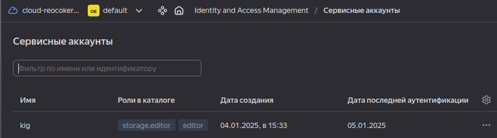
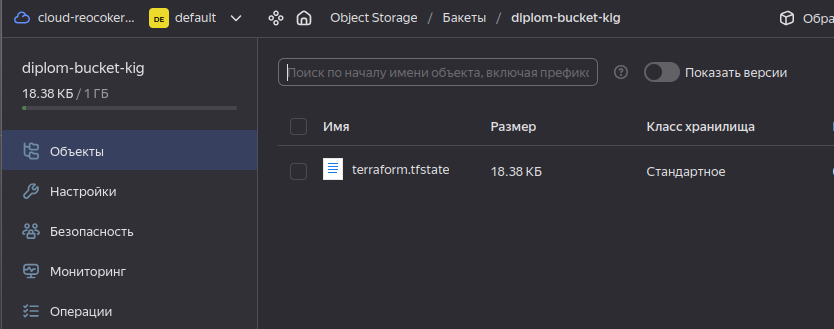
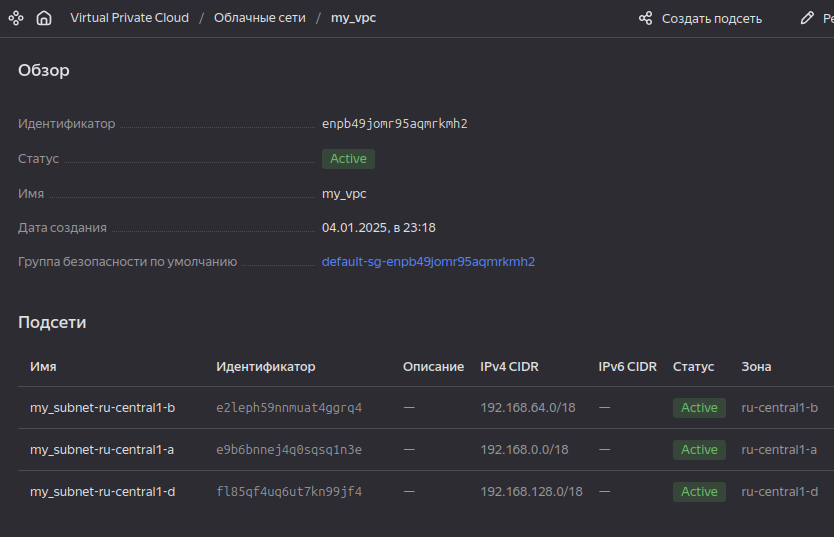
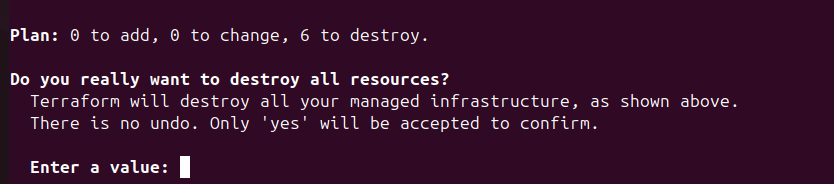
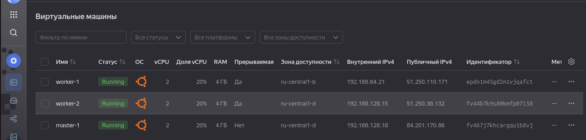
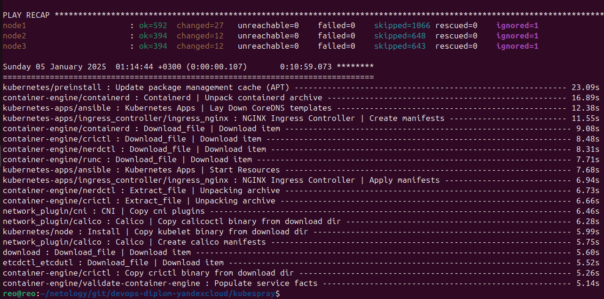
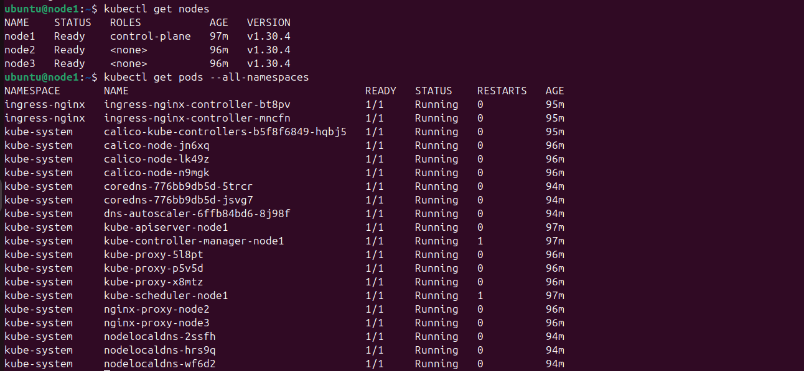

# Дипломный практикум в Yandex.Cloud
  * [Цели:](#цели)
  * [Этапы выполнения:](#этапы-выполнения)
     * [Создание облачной инфраструктуры](#создание-облачной-инфраструктуры)
     * [Создание Kubernetes кластера](#создание-kubernetes-кластера)
     * [Создание тестового приложения](#создание-тестового-приложения)
     * [Подготовка cистемы мониторинга и деплой приложения](#подготовка-cистемы-мониторинга-и-деплой-приложения)
     * [Установка и настройка CI/CD](#установка-и-настройка-cicd)
  * [Что необходимо для сдачи задания?](#что-необходимо-для-сдачи-задания)
  * [Как правильно задавать вопросы дипломному руководителю?](#как-правильно-задавать-вопросы-дипломному-руководителю)

**Перед началом работы над дипломным заданием изучите [Инструкция по экономии облачных ресурсов](https://github.com/netology-code/devops-materials/blob/master/cloudwork.MD).**

---
## Цели:

1. Подготовить облачную инфраструктуру на базе облачного провайдера Яндекс.Облако.
2. Запустить и сконфигурировать Kubernetes кластер.
3. Установить и настроить систему мониторинга.
4. Настроить и автоматизировать сборку тестового приложения с использованием Docker-контейнеров.
5. Настроить CI для автоматической сборки и тестирования.
6. Настроить CD для автоматического развёртывания приложения.

---
## Этапы выполнения:

### Создание облачной инфраструктуры

Предварительная подготовка к установке и запуску Kubernetes кластера.

1. Сервисный аккаунт, который будет в дальнейшем использоваться Terraform для работы с инфраструктурой с необходимыми и достаточными правами.

2. S3 bucket в созданном ЯО аккаунте:

3. VPC с подсетями в разных зонах доступности.

4. Теперь можем выполнить команды `terraform destroy` и `terraform apply` без дополнительных ручных действий.

---
### Создание Kubernetes кластера

1. При помощи Terraform подготовил 3 виртуальных машины Compute Cloud для создания Kubernetes-кластера.

2. Воспользовашись Ansible и Kubespray, задеплоил Kubernetes на подготовленные ранее инстансы.

---
### Создание тестового приложения

Для перехода к следующему этапу необходимо подготовить тестовое приложение, эмулирующее основное приложение разрабатываемое вашей компанией.

Способ подготовки:

1. Рекомендуемый вариант:  
   а. Создайте отдельный git репозиторий с простым nginx конфигом, который будет отдавать статические данные.  
   б. Подготовьте Dockerfile для создания образа приложения.  
2. Альтернативный вариант:  
   а. Используйте любой другой код, главное, чтобы был самостоятельно создан Dockerfile.

Ожидаемый результат:

1. Git репозиторий с тестовым приложением и Dockerfile.
2. Регистри с собранным docker image. В качестве регистри может быть DockerHub или [Yandex Container Registry](https://cloud.yandex.ru/services/container-registry), созданный также с помощью terraform.

---
### Подготовка cистемы мониторинга и деплой приложения

Уже должны быть готовы конфигурации для автоматического создания облачной инфраструктуры и поднятия Kubernetes кластера.  
Теперь необходимо подготовить конфигурационные файлы для настройки нашего Kubernetes кластера.

Цель:
1. Задеплоить в кластер [prometheus](https://prometheus.io/), [grafana](https://grafana.com/), [alertmanager](https://github.com/prometheus/alertmanager), [экспортер](https://github.com/prometheus/node_exporter) основных метрик Kubernetes.
2. Задеплоить тестовое приложение, например, [nginx](https://www.nginx.com/) сервер отдающий статическую страницу.

Способ выполнения:
1. Воспользоваться пакетом [kube-prometheus](https://github.com/prometheus-operator/kube-prometheus), который уже включает в себя [Kubernetes оператор](https://operatorhub.io/) для [grafana](https://grafana.com/), [prometheus](https://prometheus.io/), [alertmanager](https://github.com/prometheus/alertmanager) и [node_exporter](https://github.com/prometheus/node_exporter). Альтернативный вариант - использовать набор helm чартов от [bitnami](https://github.com/bitnami/charts/tree/main/bitnami).

2. Если на первом этапе вы не воспользовались [Terraform Cloud](https://app.terraform.io/), то задеплойте и настройте в кластере [atlantis](https://www.runatlantis.io/) для отслеживания изменений инфраструктуры. Альтернативный вариант 3 задания: вместо Terraform Cloud или atlantis настройте на автоматический запуск и применение конфигурации terraform из вашего git-репозитория в выбранной вами CI-CD системе при любом комите в main ветку. Предоставьте скриншоты работы пайплайна из CI/CD системы.

Ожидаемый результат:
1. Git репозиторий с конфигурационными файлами для настройки Kubernetes.
2. Http доступ на 80 порту к web интерфейсу grafana.
3. Дашборды в grafana отображающие состояние Kubernetes кластера.
4. Http доступ на 80 порту к тестовому приложению.
---
### Установка и настройка CI/CD

Осталось настроить ci/cd систему для автоматической сборки docker image и деплоя приложения при изменении кода.

Цель:

1. Автоматическая сборка docker образа при коммите в репозиторий с тестовым приложением.
2. Автоматический деплой нового docker образа.

Можно использовать [teamcity](https://www.jetbrains.com/ru-ru/teamcity/), [jenkins](https://www.jenkins.io/), [GitLab CI](https://about.gitlab.com/stages-devops-lifecycle/continuous-integration/) или GitHub Actions.

Ожидаемый результат:

1. Интерфейс ci/cd сервиса доступен по http.
2. При любом коммите в репозиторие с тестовым приложением происходит сборка и отправка в регистр Docker образа.
3. При создании тега (например, v1.0.0) происходит сборка и отправка с соответствующим label в регистри, а также деплой соответствующего Docker образа в кластер Kubernetes.

---
## Что необходимо для сдачи задания?

1. Репозиторий с конфигурационными файлами Terraform и готовность продемонстрировать создание всех ресурсов с нуля.
2. Пример pull request с комментариями созданными atlantis'ом или снимки экрана из Terraform Cloud или вашего CI-CD-terraform pipeline.
3. Репозиторий с конфигурацией ansible, если был выбран способ создания Kubernetes кластера при помощи ansible.
4. Репозиторий с Dockerfile тестового приложения и ссылка на собранный docker image.
5. Репозиторий с конфигурацией Kubernetes кластера.
6. Ссылка на тестовое приложение и веб интерфейс Grafana с данными доступа.
7. Все репозитории рекомендуется хранить на одном ресурсе (github, gitlab)

